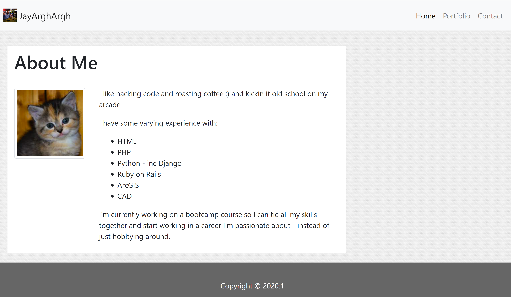

# responsive-portfolio
Responsive portfolio built with html, css, bootstrap

Can be viewed at the following link(s):
- [Hosted Page on GitHub](https://jayarghargh.github.io/responsive-portfolio/)
- [Repository on GitHub](https://github.com/JayArghArgh/responsive-portfolio)



## Requirements
none.

## Setup
paste n go

## Files and Directories

```
|___README.md
|___index.html
|___assets
    |___style.css
    |___img
        |___EscapeBot.png
        |___jr.jpg
        |___JRComix_square.png
        |___Pod137_square.png
        |___white_bed_sheet.png
```
